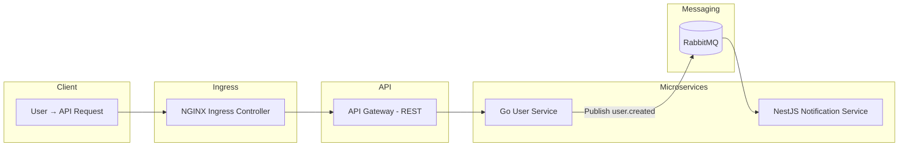

# Kind Microservices Demo

A fully containerized microservices playground running on **Kind (Kubernetes-in-Docker)**, featuring **Golang**, **NestJS**, **RabbitMQ**, **NGINX Ingress**, and a local **Docker registry**.

This project demonstrates a clean, minimal example of an **event-driven microservices architecture** deployed inside a local Kubernetes cluster.

## Overview

### Microservices

- **API Gateway (Go, REST)** Exposes `POST /users` and forwards requests to the User Service.

- **User Service (Go, REST)** Creates a user and publishes a `user.created` event to RabbitMQ.

- **Notification Service (NestJS + RabbitMQ)** Subscribes to `user.created` and logs: _“Welcome email sent to <user name>”_.

### Infrastructure Components

- **Kind Cluster** – Includes custom node config, Metrics Server, namespaces, LoadBalancer support via `cloud-provider-kind`, and liveness/readiness probes.
- **Local Docker Registry** – Used by Kind to pull microservice images.
- **RabbitMQ (StatefulSet)** – Provides persistent message queues.
- **NGINX Ingress Controller** – Routes external traffic to the API Gateway.
- **Devbox Environment** – Reproducible dev environment with `docker`, `kind`, `kubectl`, and `cloud-provider-kind`.

### Architecture



## Requirements

Install locally:

- [Docker](https://docs.docker.com/engine/install)
- [Kind](https://kind.sigs.k8s.io/docs/user/quick-start/#installation)
- [kubectl](https://kubernetes.io/docs/tasks/tools/#kubectl)
- [cloud-provider-kind](https://github.com/kubernetes-sigs/cloud-provider-kind)
- [make](https://www.gnu.org/software/make/)

Alternatively, install only [Devbox](https://www.jetify.com/docs/devbox/installing-devbox) and run below command inside the project root:

```bash
devbox shell
```

Inside the shell, tools like Kind, kubectl, and cloud-provider-kind are installed and isolated to the project directory. (you still need to install Docker separately)

## Setup & Deployment

### Create Kind Cluster

This will:

- Create a Kind cluster
- Start a local Docker registry
- Install Metrics Server
- Create namespaces
- Switch kubectl context

```bash
make kind-create-cluster
```

### Deploy NGINX Ingress Controller

below command will install NGINX Ingress and start cloud-provider-kind in background:

```bash
make kind-deploy-nginx-ingress
```

The command will wait for External IP to be available but if it times out, you can manually check via:

```bash
kubectl get service -n ingress-nginx
```

### Add Host Entry

Edit `/etc/hosts`:

```
[External-IP] microservices.local
```

Hostname is defined inside: `k8s/api-gateway/ingress.yaml`.

### Build & Push Microservice Images

Build:

```bash
make kind-build-images
```

Push to the local registry:

```bash
make kind-push-images
```

### Deploy All Services

Deploy RabbitMQ + all microservices:

```bash
make kind-deploy-services
```

Check readiness:

```bash
kubectl get pods -n microservices
kubectl get pods -n datastores
```

### Test the Setup

Create a user:

```bash
curl -X POST http://microservices.local/users \
  -H "Content-Type: application/json" \
  -d '{"name": "daniel", "email": "daniel@example.com", "password": "123"}'
```

Check Notification Service logs:

```bash
kubectl logs -f deployment/notification-service -n microservices
```

You should see something like:

```json
{
  "level": "log",
  "pid": 25,
  "timestamp": 1764442767463,
  "message": "Sending welcome email to daniel",
  "context": "NotificationController"
}
```

### Cleanup

Delete the Kind cluster:

```bash
make kind-delete-cluster
```

## Debugging & Troubleshooting

### View Logs (Example: Notification Service)

Deployment logs:

```bash
kubectl logs -n microservices deployment/notification-service
```

Specific pod logs:

```bash
kubectl get pods -n microservices
kubectl logs -n microservices <pod-name>
```

Stream logs:

```bash
kubectl logs -n microservices -f deployment/notification-service
```

### Check Pod / Deployment Status

Pods:

```bash
kubectl get pods -n microservices
```

Describe:

```bash
kubectl describe pod -n microservices <pod-name>
```

Deployments:

```bash
kubectl get deployment -n microservices
kubectl describe deployment -n microservices <deployment-name>
```

Services:

```bash
kubectl get service -n microservices
```

Live watching:

```bash
kubectl get pods -n microservices -w
```

### Access RabbitMQ Management UI

```bash
kubectl port-forward -n datastores service/rabbitmq 15672:15672
```

Then open:

```
http://localhost:15672
```

Default credentials:

- **Username:** `default`
- **Password:** `default`

### Services Restarting? (Expected Behavior)

Pods may restart during initial startup due to:

- RabbitMQ image pulling
- RabbitMQ not ready yet
- Microservices waiting for RabbitMQ connection
- Readiness/liveness probes failing until dependencies are up

Wait a moment and check:

```bash
kubectl get pods -n microservices
kubectl get pods -n datastores
```

Watch all namespaces:

```bash
kubectl get pods -A -w
```

## Support & Contributions

If you find this project useful, consider giving it a ⭐, it helps others discover it.

Contributions, feedback, and suggestions are always welcome.
Feel free to open an issue or submit a PR anytime.
