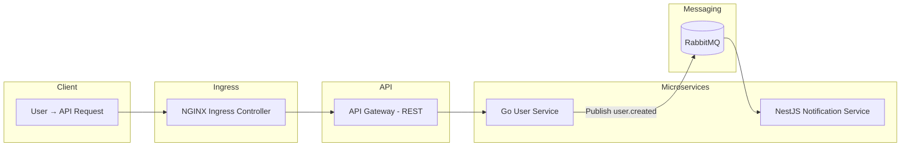

# Kind Microservices Demo

A fully containerized microservices playground running on **Kind (Kubernetes-in-Docker)**, featuring **Golang**, **NestJS**, **RabbitMQ**, **NGINX Ingress**, and a local Docker registry.

This project demonstrates a clean, minimal example of an **event-driven microservices architecture** deployed inside a local Kubernetes cluster.

---

## Overview

### **Microservices**

- **API Gateway (Go, REST)**
  Exposes `POST /users` and forwards requests to the User Service.

- **User Service (Go, REST)**
  Creates a user and publishes a `user.created` event to RabbitMQ.

- **Notification Service (NestJS + RabbitMQ)**
  Subscribes to `user.created` and logs:
  _“Welcome email sent to <user name>”_.

### **Infrastructure Components**

- **Local Docker Registry** (`registry` container)
  Used by Kind to pull microservice images.

- **RabbitMQ (StatefulSet)**
  Provides durable message queues.

- **NGINX Ingress Controller**
  Routes external traffic to the API Gateway.

- **Kind Cluster Setup**

  - Custom node configuration
  - Metrics Server
  - Namespaces
  - LoadBalancer support via `cloud-provider-kind`

- **Devbox Environment**
  Creates a reproducible development environment containing:

  - kind
  - kubectl
  - k9s
  - cloud-provider-kind
    ...and more.

### Architecture



---

## Requirements

Install locally:

- Docker
- Kind
- Kubectl
- Kubectx
- cloud-provider-kind
- k9s (optional but recommended)
- make

### **Alternative: Use Devbox**

Install only:

```bash
devbox shell
```

Inside the shell, tools such as kind, kubectl, k9s, and cloud-provider-kind are automatically available.

> **Note:** Docker must still be installed separately.

---

## Setup & Deployment

### Create Kind Cluster

This will:

- Create a Kind cluster
- Start a local Docker registry
- Install Metrics Server
- Create namespaces
- Switch kubectl context

```bash
make kind-create-cluster
```

### Deploy NGINX Ingress Controller

```bash
make kind-deploy-nginx-ingress
```

Then in **another terminal**, run:

```bash
cloud-provider-kind
```

This assigns an external LoadBalancer IP.

If it times out, manually check:

```bash
kubectl get svc -n ingress-nginx
```

### Add Host Entry

Edit `/etc/hosts`:

```
[External-IP] microservices.local
```

Hostname is defined inside: `k8s/api-gateway/ingress.yaml`.

### Build & Push Microservice Images

Build:

```bash
make kind-build-images
```

Push to the local registry:

```bash
make kind-push-images
```

### Deploy All Services

Deploy RabbitMQ + all microservices:

```bash
make kind-deploy-services
```

Check readiness:

```bash
kubectl get pods -n microservices
kubectl get pods -n datastores
```

Or simply open:

```bash
k9s
```

### Test the Setup

Create a user:

```bash
curl -X POST -H "Content-Type: application/json" \
  -d '{"name": "daniel", "email": "daniel@gmail.com", "password": "123"}' \
  http://microservices.local/users | jq
```

Expected Notification Service log:

```
Welcome email sent to daniel
```

### Cleanup

Delete the Kind cluster:

```bash
make kind-delete-cluster
```

---

## Debugging & Troubleshooting

### View Logs (Example: Notification Service)

Deployment logs:

```bash
kubectl logs -n microservices deploy/notification-service
```

Specific pod logs:

```bash
kubectl get pods -n microservices
kubectl logs -n microservices <pod-name>
```

Stream logs:

```bash
kubectl logs -n microservices -f deploy/notification-service
```

### Check Pod / Deployment Status

Pods:

```bash
kubectl get pods -n microservices
```

Describe:

```bash
kubectl describe pod -n microservices <pod-name>
```

Deployments:

```bash
kubectl get deploy -n microservices
kubectl describe deploy -n microservices <deployment-name>
```

Services:

```bash
kubectl get svc -n microservices
```

Live watching:

```bash
watch kubectl get pods -n microservices
```

Or open:

```bash
k9s
```

### Access RabbitMQ Management UI

```bash
kubectl port-forward -n datastores svc/rabbitmq 15672:15672
```

Then open:

```
http://localhost:15672
```

Default credentials:

- **Username:** `default`
- **Password:** `default`

### Services Restarting? (Expected Behavior)

Pods may restart during initial startup due to:

- RabbitMQ image pulling
- RabbitMQ not ready yet
- Microservices waiting for RabbitMQ connection
- Readiness/liveness probes failing until dependencies are up

Wait a moment and check:

```bash
kubectl get pods -n microservices
kubectl get pods -n datastores
```

Watch all namespaces:

```bash
watch kubectl get pods -A
```

---

## Support & Contributions

If you find this project useful, consider starring the repository — it helps others discover it.

Contributions, feedback, and suggestions are welcome!
Feel free to open an issue or submit a PR.
